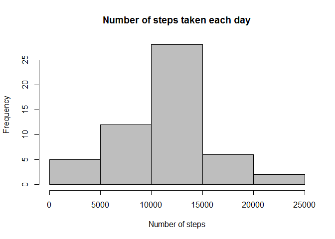

# Peer Assessment 1 - Reproducible Research Course
Alexandre Barros (AlexFBar)  
Sunday, May 17, 2015  
---

###1. Description

This assignment makes use of data from a personal activity monitoring device. This device collects data at 5 minute intervals through out the day. The data consists of two months of data from an anonymous individual collected during the months of October and November, 2012 and include the number of steps taken in 5 minute intervals each day.

The variables included in this dataset are:

* **steps**: Number of steps taking in a 5-minute interval (missing values are coded as NA)
* **date**: The date on which the measurement was taken in YYYY-MM-DD format
* **interval**: Identifier for the 5-minute interval in which measurement was taken

The dataset is stored in a comma-separated-value (CSV) file and there are a total of 17,568 observations in this dataset.

---

###2. Loading and preprocessing the data
**Step1 - Load the data:**

This step is about load the data into *DataSet* data frame. The *head* function return the first 6 rows of data frame.


```r
DataSet <- read.csv("activity.csv")
head(DataSet)
```

```
##   steps       date interval
## 1    NA 2012-10-01        0
## 2    NA 2012-10-01        5
## 3    NA 2012-10-01       10
## 4    NA 2012-10-01       15
## 5    NA 2012-10-01       20
## 6    NA 2012-10-01       25
```

---

###3. What is mean total number of steps taken per day?
**Step1 - Calculate the total number of steps taken per day:** 

Use *aggregate* function to sum number of steps per day in *DataSet* data frame.


```r
TotStepsPerDay <- aggregate(steps ~ date, DataSet, sum)
head(TotStepsPerDay)
```

```
##         date steps
## 1 2012-10-02   126
## 2 2012-10-03 11352
## 3 2012-10-04 12116
## 4 2012-10-05 13294
## 5 2012-10-06 15420
## 6 2012-10-07 11015
```

**Step2 - Histogram of the total number of steps taken each day:**

To represent the distribution of number of steps per day we can use the histogram plot like below. The function used is *hist* in base plot system.


```r
hist(TotStepsPerDay[,"steps"],col="grey",main="Number of steps taken each day",xlab="Number of steps",ylab="Frequency")
```

 

**Step3 - Mean and median of the total number of steps taken per day:**

To show the mean and median of number of steps per day we can use *summary* function. This function calculate these numbers automaticaly.


```r
summary(TotStepsPerDay[,"steps"])
```

```
##    Min. 1st Qu.  Median    Mean 3rd Qu.    Max. 
##      41    8841   10760   10770   13290   21190
```


The **mean** is 10770 steps and **median** is 10760 steps.

---

###4. What is the average daily activity pattern?
**Step1 - Time series plot of the 5-minute interval and the average number of steps taken, averaged across all days**

Create a data frame with mean of daily steps per interval of 5 minutes.


```r
AvgDayStepsPerInterval <- aggregate(steps ~ interval, DataSet, mean)
head(AvgDayStepsPerInterval)
```

```
##   interval     steps
## 1        0 1.7169811
## 2        5 0.3396226
## 3       10 0.1320755
## 4       15 0.1509434
## 5       20 0.0754717
## 6       25 2.0943396
```

Next we plot the new data frame in linear graphic basic plot.


```r
plot(AvgDayStepsPerInterval$interval,AvgDayStepsPerInterval$steps,type="l",lwd=2,main="The mean of steps taken for each 5 minutes per day (average)",xlab="Minutes (interval of 5min. - average of all 53 days)",ylab="Number of steps")
```

 

**Step2 - Which 5-minute interval, on average across all the days in the dataset, contains the maximum number of steps?**

The command below answer this question:


```r
AvgDayStepsPerInterval[which.max(AvgDayStepsPerInterval[,"steps"]),]
```

```
##     interval    steps
## 104      835 206.1698
```

The interval of **835 minutes** contains the maximum number of steps in average of all days.

---

###5. Imputing missing values
**Step1 - Calculate and report the total number of missing values in the dataset:**


```r
nrow(DataSet[which(is.na(DataSet$steps)),])
```

```
## [1] 2304
```

The number of *NA* steps rows in original DataSet are **2304 rows**.

**Step2 - Devise a strategy for filling in all of the missing values in the dataset:**

To choose the method to how we can aggregate *NA* values of original data set, first I need know if the *NA* values are for intervals or days. To discover it, I made the code below.

This code will return only *NA* steps values groups per day.


```r
aggregate(interval ~ date, DataSet[which(is.na(DataSet$steps)),], FUN = function(x){NROW(x)})
```

```
##         date interval
## 1 2012-10-01      288
## 2 2012-10-08      288
## 3 2012-11-01      288
## 4 2012-11-04      288
## 5 2012-11-09      288
## 6 2012-11-10      288
## 7 2012-11-14      288
## 8 2012-11-30      288
```

The observation is that we have all complete days who have all intervals with *NA* values. So we need to find a value for each day in this list.

The value can be a mean of each interval of consecutive days. For example, the day 2012-10-01 wil receive de same value of the day 2012-10-02, but the day 2012-10-08 will receive the mean of days 7 and 9. Of corse, the mean per interval of consecutive day.

**Step3 - Create a new dataset that is equal to the original dataset but with the missing data filled in:**

Following the idea above (Step2) we can create the code:


```r
DataSet2<-DataSet
DataSet2$steps[DataSet2$date=="2012-10-01"]<-DataSet2$steps[DataSet2$date=="2012-10-02"]
DataSet2$steps[DataSet2$date=="2012-10-08"]<-round((DataSet2$steps[DataSet2$date=="2012-10-07"]+DataSet2$steps[DataSet2$date=="2012-10-09"])/2,0)
DataSet2$steps[DataSet2$date=="2012-11-01"]<-round((DataSet2$steps[DataSet2$date=="2012-10-31"]+DataSet2$steps[DataSet2$date=="2012-11-02"])/2,0)
DataSet2$steps[DataSet2$date=="2012-11-04"]<-round((DataSet2$steps[DataSet2$date=="2012-11-03"]+DataSet2$steps[DataSet2$date=="2012-11-05"])/2,0)
DataSet2$steps[DataSet2$date=="2012-11-09"]<-round((DataSet2$steps[DataSet2$date=="2012-11-08"]+DataSet2$steps[DataSet2$date=="2012-11-11"])/2,0)
DataSet2$steps[DataSet2$date=="2012-11-10"]<-round((DataSet2$steps[DataSet2$date=="2012-11-08"]+DataSet2$steps[DataSet2$date=="2012-11-11"])/2,0)
DataSet2$steps[DataSet2$date=="2012-11-14"]<-round((DataSet2$steps[DataSet2$date=="2012-11-13"]+DataSet2$steps[DataSet2$date=="2012-11-15"])/2,0)
DataSet2$steps[DataSet2$date=="2012-11-30"]<-DataSet2$steps[DataSet2$date=="2012-11-29"]
```

The validation on **DataSet2**:


```r
nrow(DataSet2[which(is.na(DataSet2$steps)),])
```

```
## [1] 0
```

There are no *NA* steps on **DataSet2**.

**Step4 - Make a histogram of the total number of steps taken each day and Calculate and report the mean and median total number of steps taken per day:**

The same process like item 3 steps 1, 2 and 3 above for *DataSet2*:


```r
TotStepsPerDay2 <- aggregate(steps ~ date, DataSet2, sum)
hist(TotStepsPerDay2[,"steps"],col="grey",main="Number of steps taken each day (NA tratement)",xlab="Number of steps",ylab="Frequency")
```

 


```r
summary(TotStepsPerDay2[,"steps"])
```

```
##    Min. 1st Qu.  Median    Mean 3rd Qu.    Max. 
##      41    8334   10570   10370   12880   21190
```


The **mean** is 10370 steps and **median** is 10570 steps.

This result set is different from the first calculation. The interpolaton of a data set can change the results, so you must pay attention at the method who you use to discover the missing values.

---

###6. Are there differences in activity patterns between weekdays and weekends?
**Step1 - Create a new factor variable in the dataset with two levels - "weekday" and "weekend" indicating whether a given date is a weekday or weekend day:**


```r
DataSet$week <- weekdays(as.Date(DataSet$date))
DataSet[DataSet$week=="Sunday"|DataSet$week=="Saturday","week"] <- "weekend"
DataSet[DataSet$week=="Monday"|DataSet$week=="Tuesday"|DataSet$week=="Wednesday"|DataSet$week=="Thursday"|DataSet$week=="Friday","week"] <- "weekday"
aggregate(date ~ week, DataSet, FUN = function(x){NROW(x)})
```

```
##      week  date
## 1 weekday 12960
## 2 weekend  4608
```

The new column on original **DataSet** indicate if date is a weekday or weekend.

**Step2 - Panel plot containing a time series plot of the 5-minute interval and the average number of steps taken, averaged across all weekday days or weekend days:**

Creating 2 new data sets with weekday and weekend data.


```r
AvgDayStepsPerIntervalWeekend <- aggregate(steps ~ interval, DataSet[DataSet$week=="weekend",], mean)
AvgDayStepsPerIntervalWeekday <- aggregate(steps ~ interval, DataSet[DataSet$week=="weekday",], mean)
```

Ploting graphic with comparison:


```r
par(mfrow=c(2,1))

plot(AvgDayStepsPerIntervalWeekday$interval,AvgDayStepsPerIntervalWeekday$steps,type="l",lwd=2,main="The mean of steps taken for each 5 minutes per Weekday (average)",xlab="Minutes (interval of 5min. - average of all 53 days)",ylab="Number of steps")
plot(AvgDayStepsPerIntervalWeekend$interval,AvgDayStepsPerIntervalWeekend$steps,type="l",lwd=2,main="The mean of steps taken for each 5 minutes per Weekend (average)",xlab="Minutes (interval of 5min. - average of all 53 days)",ylab="Number of steps")
```

 

---
